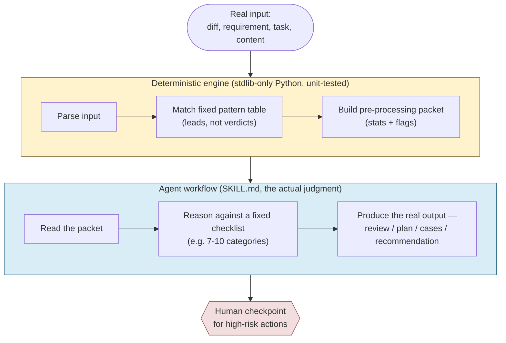

# Agentic Engineering Skills Platform


An open effort to build reusable, evaluated, secure engineering capabilities
for AI coding agents, distributed as a portable `SKILL.md` contract — and
built, deliberately, in the open about what's actually proven versus what's
still assumed.

**New here?** Read [`QuickStarterGuide.md`](QuickStarterGuide.md) to clone,
run a skill, and run the tests in under 10 minutes. This file is the map;
that one is the walkthrough.

---

## The problem this is trying to solve

AI coding agents are capable enough now that "just prompt it" scales
surprisingly far — until it doesn't. A prompt has no version, no declared
inputs/outputs, no security constraints, no evaluation history, and no way
to say "this has been tested against 8 cases and here's exactly where it's
known to fail." Engineers already write ad-hoc prompt templates and reuse
them informally; this project's working thesis is that a standardized,
evaluated, secure version of that reuse is a natural next step —
**a hypothesis being actively tested here, not a foregone conclusion**. See
[`project-memory-bank/01-product-thesis.md`](project-memory-bank/01-product-thesis.md).


This repo currently sits at step **C — Evaluated Skill** for all five skills
it ships. None has been promoted to Trusted, none is composed into a
registry, and that's stated plainly rather than implied otherwise anywhere
in this repo.

## Why this project looks the way it does

Three engineering decisions shape everything else here, and they're worth
understanding before the skill list below makes full sense:

1. **A skill is a contract, not a prompt.** Every skill ships as a
   `SKILL.md` file with mandatory sections — Purpose, Preconditions,
   Security Constraints, Workflow, Human Checkpoints, Known Limitations,
   Evaluation — enforced by [`project-memory-bank/04-skill-contract.md`](project-memory-bank/04-skill-contract.md).
   No skill claims a maturity level or trust status its evidence doesn't
   support.
2. **Deterministic code and AI judgment are architecturally separated.**
   Where a task is genuinely mechanical (parsing, structure extraction), a
   small stdlib-only Python engine does it, unit-tested like any other code.
   Where a task is genuinely a judgment call (is this diff safe, does this
   action need approval), that judgment stays in the agent's workflow
   against a fixed checklist — never faked as deterministic. See the
   [architecture pattern](#architecture-two-patterns-reused-five-times)
   below.
3. **Every honesty valve is left open, on purpose.** Four of five skills'
   evaluation harnesses currently report 100% precision/recall — and every
   one of them says, in the same breath, that this is self-authored,
   single-rater evidence and should not be trusted as proof of real-world
   quality. That's not a caveat added under pressure; it's designed into
   the evaluation framework from the start (see
   [Evaluation & Honesty](#evaluation--honesty-this-is-the-part-most-repos-skip)).

## The five skills

| # | Skill | What it does | Pattern | Tests | Status |
|---|---|---|---|---|---|
| 1 | [`codebase-intelligence`](skills/codebase-intelligence/) | Deterministic structural map of a repo — imports, defs, dependency graph, hotspots | Pattern 1 (fully deterministic) | 23/23 | EXPERIMENTAL |
| 2 | [`adversarial-diff-reviewer`](skills/adversarial-diff-reviewer/) | Flags mechanical risk patterns in a diff, then an agent performs an adversarial review against a 10-category failure-first checklist | Pattern 2 | 23/23 | EXPERIMENTAL |
| 3 | [`acceptance-test-engineer`](skills/acceptance-test-engineer/) | Turns a vague requirement into structured, testable acceptance cases via a 10-category coverage checklist | Pattern 2 | 24/24 | EXPERIMENTAL |
| 4 | [`feature-planner`](skills/feature-planner/) | Turns a task description into a grounded, structured plan — **requires** a `codebase-intelligence` report as a hard precondition | Pattern 2 + mandatory composition | 21/21 | EXPERIMENTAL |
| 5 | [`security-context-guard`](skills/security-context-guard/) | Classifies content/actions for secrets, PII, sensitive paths, and high-risk actions; recommends — never self-authorizes — human approval | Pattern 2 + advisory-only by hard rule | 58/58 | EXPERIMENTAL |

**149 tests passing across the platform.** Every skill also ships an
evaluation harness against hand-authored fixtures
(`evaluations/<skill>/RESULTS.md`) and a real "dogfood" run against actual
work, not a synthetic demo (`examples/<skill>/example-run.md`).

## Quickstart

```bash
git clone <this-repository-url>
cd agentic_engineering_skills_platform

# Try the simplest skill against this repo itself
cd skills/codebase-intelligence
python -m engine.cli ../.. --format markdown

# Run its tests
pip install -e ".[dev]"
pytest
```

Full walkthrough, including the two skills that need extra input and the one
that composes with another: [`QuickStarterGuide.md`](QuickStarterGuide.md).
Dependency details (there are almost none — that's deliberate):
[`DEPENDENCIES.md`](DEPENDENCIES.md).

## Architecture: two patterns, reused five times

Every skill in this repo is built from one of two architectural patterns —
no sixth pattern has been needed yet, and neither has changed shape since it
was first established. Full detail, including the reference implementation
for each: [`project-memory-bank/03-architecture.md`](project-memory-bank/03-architecture.md).

**Pattern 1 — fully deterministic** (`codebase-intelligence` only, so far):
used when the task is genuinely mechanical. No judgment layer needed because
there's no judgment being made.

**Pattern 2 — deterministic pre-processor + agent-driven judgment** (the
other four skills, reused four consecutive times without needing a new base
pattern):



The engine's pattern table is explicitly a **lead generator, never a
verdict** — every `SKILL.md` in this repo says so, and the evaluation
fixtures prove why: in `adversarial-diff-reviewer`'s 8 seeded-defect
fixtures, 6 have *zero* deterministic risk flags but a real seeded defect,
caught only by the agent's Step 3 reasoning. That gap is the entire reason
this pattern has two layers instead of one — a single regex table dressed
up as "AI code review" would quietly miss most of what actually matters.

`security-context-guard` (skill 5) pushes this one step further:
[ADR-011](project-memory-bank/11-decisions.md) makes it a hard architectural
rule, not just a convention, that the engine's `suggested_verdict` is always
advisory — the deterministic layer classifies and recommends, it never
authorizes a high-risk action itself. Only the agent's workflow, and
ultimately a human, makes that call.

## Evaluation & honesty (this is the part most repos skip)

Every judgment-based skill's evaluation harness scores two layers
separately:

- **Deterministic layer** — fully automated, scored against hand-authored
  ground truth (pattern matches, classification correctness).
- **Judgment layer** — Precision/Recall/False-Positives/False-Negatives
  computed by comparing an AI agent's *actual* derivation for each fixture
  against hand-authored expected output.

All four judgment-based skills currently score **100% precision/recall** on
their judgment layer. Read that number in context, not in isolation: the
same agent session authored the fixtures, the expected ground truth, *and*
the actual derivation, for all four skills. There was no independent party
anywhere in that loop. A perfect score under those conditions demonstrates
the workflow is **executable and internally consistent** — it does not, and
cannot, demonstrate real-world review/planning/classification quality. This
is disclosed at the top of every `RESULTS.md`, in every `SKILL.md`'s
Evaluation section, and tracked as an explicit open item
([`L8`](project-memory-bank/12-known-limitations.md)) rather than left for
someone else to discover:

> "Four-for-four perfect self-graded scores is now the established pattern,
> not a new finding — it continues to show this evaluation design cannot
> yet discriminate good derivation from mediocre." — [`07-current-state.md`](project-memory-bank/07-current-state.md)

The project also runs small, explicitly-labeled internal pilots (N=1,
self-run, un-blinded) toward its bigger open questions — whether skills beat
plain prompting, whether composition beats isolation, whether security
handling increases trust — and refuses to let a pilot's result be cited as
if it were the real experiment
([ADR-009](project-memory-bank/11-decisions.md)). See
[`project-memory-bank/17-experiment-viability-check.md`](project-memory-bank/17-experiment-viability-check.md)
and [`16-assumptions-and-validation.md`](project-memory-bank/16-assumptions-and-validation.md)
for the full, current, honestly-scored ledger.

If you want the fuller argument for why this matters and what it looks like
in practice, read
[Your AI Eval Says 100%. That Should Worry You.](blogs/04-your-ai-eval-says-100-percent.md)
in the blog series.

## Real bugs found by using this on real work

Every skill has been "dogfooded" — run against real material (this repo's
own source, this project's own real pending decisions) rather than only
synthetic fixtures. That practice has found and fixed five real defects
across five phases, cataloged transparently in
[`project-memory-bank/12-known-limitations.md`](project-memory-bank/12-known-limitations.md)
rather than quietly patched and forgotten:

| ID | Skill | What a synthetic fixture would have missed |
|---|---|---|
| L1 | codebase-intelligence | Flagged files as CLI entry points just because `__name__ == "__main__"` appeared in a *docstring* |
| L5 / L6 | adversarial-diff-reviewer | A secret was redacted in the risk flag but leaked into the raw diff content; then a second secret on the same line leaked past the first fix |
| L10 | adversarial-diff-reviewer | Its own CLI had zero test coverage — found by a *different* skill dogfooding against it |
| L13 | feature-planner | `acceptance-test-engineer`'s CLI had zero test coverage — the second cross-skill finding |
| L16 | security-context-guard | Its own action-classifier's fixed-distance regex window missed a real sentence where 150+ characters separated a verb from its target |

The full narrative for each, including exact code diffs, is in the blog
post [I Dogfooded Every Skill I Built.](blogs/03-i-dogfooded-every-skill-i-built.md)

## Project structure

```
skills/<name>/          SKILL.md contract + engine/ + tests/ + README.md
evaluations/<name>/     fixtures + expected/actual + run_evaluation.py + RESULTS.md
examples/<name>/        real "dogfood" run write-ups
blogs/                  technical deep-dives on how/why this was built
project-memory-bank/    the project's own working memory (vision → decisions →
                         current state → assumptions) — read 07-current-state.md
                         first if you want the single most current snapshot
```

## Read the blog series

Five in-depth posts on the technical decisions behind this project, written
for engineers, with real code and real data from this repo — not marketing
copy. Start anywhere; each stands alone.

1. [A Skill Is Not a Prompt](blogs/01-a-skill-is-not-a-prompt.md) — the
   contract model and why it exists
2. [Two Architectures for AI Agent Skills](blogs/02-two-architectures-for-ai-agent-skills.md)
   — when to trust code, when to trust judgment
3. [I Dogfooded Every Skill I Built](blogs/03-i-dogfooded-every-skill-i-built.md)
   — five real bugs, five real fixes
4. [Your AI Eval Says 100%. That Should Worry You.](blogs/04-your-ai-eval-says-100-percent.md)
   — the self-grading trap
5. [Building an AI Agent That Can't Authorize Its Own Actions](blogs/05-building-an-ai-agent-that-cant-authorize-its-own-actions.md)
   — the security model, end to end

## Status and roadmap

**Phase 5 complete.** Five skills, 149 tests, five evaluation harnesses,
five real dogfood runs, zero real-world usage by anyone outside this
project yet. Full current snapshot:
[`project-memory-bank/07-current-state.md`](project-memory-bank/07-current-state.md).
Full roadmap (adaptive — a phase is re-justified against evidence before it
starts, never built just because it was planned): [`ROADMAP.md`](ROADMAP.md).

## Contributing

See [`CONTRIBUTING.md`](CONTRIBUTING.md) for what a contributed skill needs
to meet (the same contract, evaluation, and security bar every skill here
meets) and what this project is deliberately not looking for yet
(orchestration, UI, duplicate skills).

## Security

See [`SECURITY.md`](SECURITY.md) to report a vulnerability, and
[`project-memory-bank/06-security-model.md`](project-memory-bank/06-security-model.md)
for the security principles every skill in this repo is built against.

## License

Apache 2.0 — see [`LICENSE`](LICENSE).
