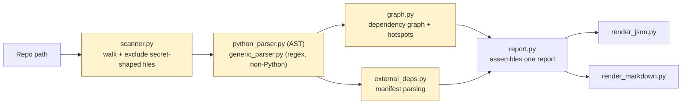
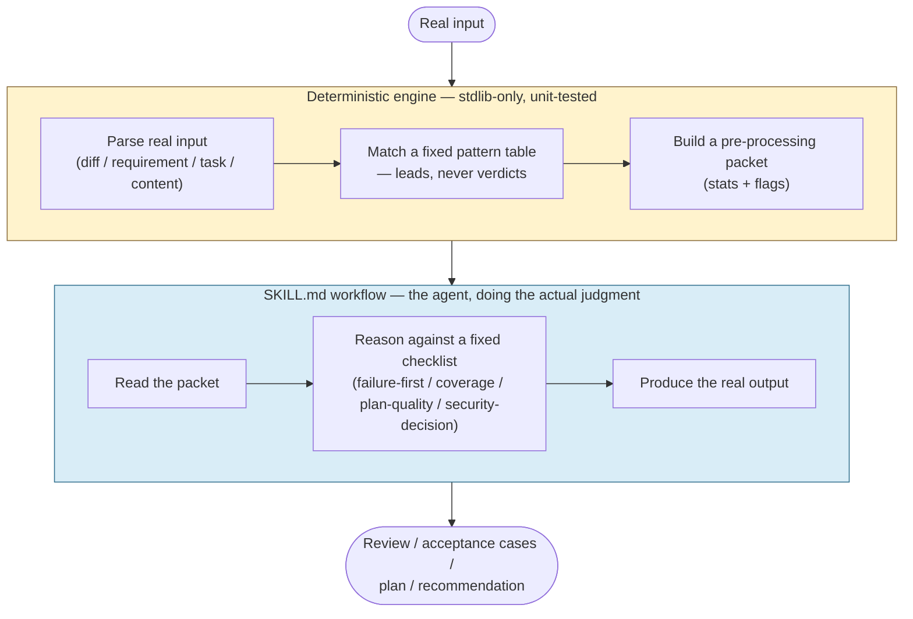

# Two Architectures for AI Agent Skills

*Part 2 of 5 in the Agentic Engineering Skills Platform series. Code
referenced here is real and current as of Phase 5.
[Repo README](../README.md) · [Part 1](01-a-skill-is-not-a-prompt.md).*

## The question every skill has to answer before a line of code gets written

Building the first skill in this platform (`codebase-intelligence` — scan a
repo, extract imports/definitions, build a dependency graph) forced a
decision that every subsequent skill has had to make again: **is the core
task deterministic, or is it a judgment call?**

Get this wrong in one direction and you write a slow, expensive, and
inconsistent LLM prompt to do something a hundred lines of `ast.parse()`
could do perfectly every time. Get it wrong in the other direction and you
write a regex table, call it "AI code review," and ship something that
mechanically pattern-matches while quietly missing every subtle bug that
doesn't happen to match a known shape. Both failure modes are common in AI
tooling today. This project picked a rule and has applied it five times
without needing a sixth option.

## Pattern 1: fully deterministic

Used exactly once so far — `codebase-intelligence` — because scanning a
repo's structure genuinely has no judgment component. An import is an
import; `ast.parse()` either finds it or it doesn't.

Every box in that diagram is stdlib-only Python, unit-tested, under 300
lines, single-responsibility. No agent reasoning happens anywhere in this
pipeline — and that's correct, because nothing in it requires reasoning.
[ADR-005](../project-memory-bank/11-decisions.md) states the rule this
pattern exists to enforce: use deterministic code "when the task is
deterministic and repeatable... not a task that genuinely requires
judgment," and explicitly: **do not** use it "when the task is inherently a
judgment call (e.g. 'is this diff safe to merge') — that belongs in the
SKILL.md workflow/agent reasoning, not baked into deterministic code."

## Pattern 2: deterministic pre-processor + agent-driven judgment

This is where four of the five skills live —
`adversarial-diff-reviewer`, `acceptance-test-engineer`, `feature-planner`,
`security-context-guard` — because "is this diff safe," "is this
requirement testable," "is this plan complete," and "does this action need
human approval" are all, honestly, judgment calls. No fixed regex table can
answer them correctly in general. Pretending otherwise would be the exact
mistake Pattern 1 explicitly warns against.

The engine's output is deliberately called a "packet," not a "result" —
naming matters here. `risk_patterns.py` in `adversarial-diff-reviewer` is a
fixed table of eleven regexes (hardcoded secrets, dangerous calls like
`eval`/`exec`, bare `except: pass`, SQL-injection shapes, debug leftovers).
It's genuinely useful — it catches the mechanically obvious cases cheaply,
every time, with zero variance. But it is not, and was never meant to be,
"the review."

### Proof the split earns its complexity: 6 of 8 fixtures have zero deterministic flags

This is the part worth sitting with, because it's the actual justification
for the two-layer split rather than a theoretical argument for it.
`adversarial-diff-reviewer`'s 8-fixture evaluation set seeds a real defect
into each fixture. In **6 of those 8 fixtures, the deterministic engine
finds zero risk flags** — the defect isn't a hardcoded secret or a bare
`except: pass`, it's something that only shows up under actual reasoning
about the change (a race condition, a logic inversion, an off-by-one in a
boundary condition). The engine stays silent. The agent, working through
`SKILL.md`'s Step 3 against the ten-category failure-first checklist
(obvious bug, subtle bug, concurrency bug, security issue, performance
regression, correct-but-unusual code, large noisy diff, missing context,
misleading implementation, incorrect requirement), catches it anyway.

If the deterministic layer were the whole skill, six out of eight real
defects in this project's own evaluation set would ship unreviewed. That
gap — not a design document, an actual measured gap in the project's own
fixtures — is why Pattern 2 has two layers instead of one.

## The pattern generalizes — four times, no new base pattern needed

What's mildly surprising, in retrospect, is how cleanly this split ported
across four completely different judgment domains:

| Skill | Judgment being made | Fixed checklist used in Step 3 |
|---|---|---|
| `adversarial-diff-reviewer` | Is this diff safe to merge? | 10-category failure-first checklist |
| `acceptance-test-engineer` | Is this requirement testable? | 10-category acceptance-coverage checklist |
| `feature-planner` | Is this plan complete and grounded? | 10-category Plan Quality checklist |
| `security-context-guard` | Does this action need human approval? | 7-category Security Decision Checklist |

Every one of these checklists ends the same way, on purpose. The first
three each dedicate their final category to what the project calls the
**honesty valve**: when the input is silent on something, the agent must
say so explicitly rather than silently picking a plausible interpretation
and presenting it as derived fact. `feature-planner`'s checklist puts it as
"Explicit assumption flag (context silent → state it, don't guess)."
`security-context-guard`'s checklist — whose job is a safety decision, not
defining ambiguous scope — adapts the same convention into "fail closed
under uncertainty": if the classifier can't determine what action is being
taken, the recommendation defaults to `REQUIRES_HUMAN_APPROVAL`, never
silently to `AUTHORIZE`. Same underlying principle (don't let silence get
mistaken for a resolved answer), reshaped to fit what each checklist is
actually deciding.

By the fourth reuse, [`03-architecture.md`](../project-memory-bank/03-architecture.md)
states this plainly rather than re-justifying it from scratch each time:
"Pattern 2 is now this project's default architecture for judgment-based
skills, not a fresh per-skill choice each time." That's a genuinely useful
kind of boring — a pattern that stopped needing a new ADR every time it got
reused is a pattern that's earned some trust.

## Where the line gets genuinely hard: composition

One more architectural question Pattern 2 doesn't answer on its own: when
one skill's output feeds another skill, is that composition *required* or
*optional*? The platform answers this differently for two different
skills, and the difference is the whole point.

`feature-planner` **requires** a `codebase-intelligence` report
([ADR-010](../project-memory-bank/11-decisions.md)) — a missing report is a
hard failure, not a degraded path. The reasoning: a plan whose "affected
files" section is guessed rather than grounded in real import/dependency
data is *actively worse than no plan*, because it looks authoritative while
being wrong.

`security-context-guard` treats the same composition as **optional**
([ADR-011](../project-memory-bank/11-decisions.md)) — a missing
`--ci-report` produces a warning, never a failure. The reasoning: this
skill's job (classify content, flag high-risk actions) is useful standalone
and doesn't become actively harmful without a structural map the way
ungrounded file-path guessing does.

Two skills, two opposite defaults, both deliberately chosen and both
justified against the same underlying test: *is ungrounded output here
actively harmful, or just less enriched?* That's the kind of distinction
that's easy to blur under time pressure and easy to get right once you
write the test down explicitly.

**Next in this series:** [I Dogfooded Every Skill I Built](03-i-dogfooded-every-skill-i-built.md)
— what actually happens when you point each of these skills at real work
instead of the fixtures you wrote for it.
