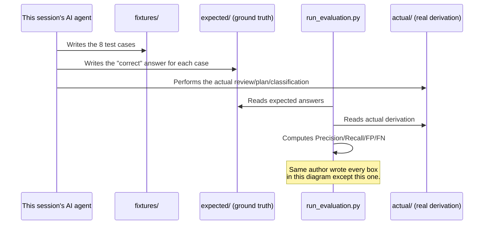

# Your AI Eval Says 100%. That Should Worry You.

*Part 4 of 5 in the Agentic Engineering Skills Platform series. All scores
cited here are real, from
[`evaluations/*/RESULTS.md`](../evaluations/) in this repository.
[Repo README](../README.md) · [Part 3](03-i-dogfooded-every-skill-i-built.md).*

## Four skills, four perfect scores, zero celebration

`adversarial-diff-reviewer`: 100% precision, 100% recall.
`acceptance-test-engineer`: 100% precision, 100% recall.
`feature-planner`: 100% precision, 100% recall.
`security-context-guard`: 100% precision, 100% recall.

Four for four, across four different judgment domains — code review,
requirement testability, task planning, security classification — each
scored against an 8-fixture evaluation harness built specifically to catch
gaps. If you stopped reading at those numbers, this would look like a
success story. It isn't one, and every `RESULTS.md` file backing those
scores says so in the same breath it reports them:

> "This is the FOURTH judgment-based skill evaluated this way... Same
> single-run, single-rater caveat: this session's agent authored the
> fixtures, the expected checklist categories, AND the actual derivation.
> Treat these scores as evidence the workflow is executable and internally
> consistent on synthetic fixtures... not as proof of real-world
> security-judgment quality."

That's not boilerplate CYA language added after the fact. It's the actual,
specific finding.

## Why a perfect score here proves less than it looks like it proves

Here's the evaluation harness's real shape, and where the problem lives:

Every arrow into that diagram except the scoring script itself originates
from the same author. There is no point in the loop where an independent
party — a second agent that didn't see the expected answers, a human
reviewer, anyone — enters the process. A precision/recall score computed
this way answers exactly one honest question: **"is the workflow
executable, and does it behave consistently with what its own author
expected it to do?"** That's a real, useful thing to know — it's not
nothing. It is categorically not the same question as "does this skill
review code well," and treating a 100% on the first question as evidence
for the second is exactly the kind of self-flattering measurement error
this project's evaluation framework was written to prevent in the first
place:

> "A convincing AI response is not engineering evidence. The model must
> never be the sole evaluator of itself for critical claims." —
> [`05-evaluation-framework.md`](../project-memory-bank/05-evaluation-framework.md)

Four-for-four is the data actually demonstrating why that principle exists,
not a violation caught after the fact and walked back — it's disclosed the
moment it happens, every time, precisely because self-grading a judgment
task is structurally unable to distinguish a genuinely good derivation from
a mediocre one that happens to match its own author's expectations. The
score can't tell the difference, by construction, no matter how careful the
author is.

## What the deterministic half gets right that the judgment half can't

It's worth being precise about what *isn't* the problem, because half of
every evaluation harness in this project is fully sound. The deterministic
layer — did the regex engine flag the right pattern, did the classifier
compute the right sensitivity level — is scored by code, against
hand-authored ground truth, with zero ambiguity and zero model-dependence.
`codebase-intelligence`'s entire evaluation (Correctness, Completeness,
Efficiency) is this kind of check, and it's genuinely trustworthy: a
regex either matched the right span or it didn't, and a script can verify
that without needing anyone's judgment at all.

The problem is specific to the second layer — where an *agent* has to
actually perform the review, the plan, the classification, and that
derivation gets scored. That's where "who wrote the answer key" stops being
a footnote and starts being the whole question.

## What real evidence would actually require

The evaluation framework names the fix explicitly, and it's not
complicated in concept, even though it hasn't been done yet:

> "Have two independent reviewers score the same skill run; measure
> agreement." — [A5, `16-assumptions-and-validation.md`](../project-memory-bank/16-assumptions-and-validation.md)

An inter-rater-agreement experiment: a second, independent agent session —
or better, a real human reviewer — scoring the same fixtures *blind*,
without visibility into the first session's expected answers or actual
derivation. If two independent parties converge on similar judgments, that's
real evidence the evaluation criteria are meaningful rather than
self-referential. If they diverge, that's *also* real evidence — evidence
the checklist is more subjective than it looks, which is exactly the kind
of thing worth knowing before anyone downstream trusts a score built on it.

This hasn't been run yet, for any of the four skills, across five project
phases. That's tracked honestly as an open item
([`L8`](../project-memory-bank/12-known-limitations.md)) rather than buried,
and by the project's own sprint retrospectives, it's now the single loudest
unaddressed item on the list — louder with every additional skill that
repeats the same self-graded pattern, because each repetition adds another
skill's trust claims resting on the same unclosed gap rather than closing
it.

## The same discipline, applied to "does this even help"

The self-grading trap isn't limited to evaluation scores — it shows up
anywhere the same session both performs a comparison and grades the result.
This project runs small internal pilots toward its bigger open questions
(does a skill beat plain prompting? does composing two skills beat using
one? does structured security classification actually change what a human
approves?) and applies the identical discipline to them:
[ADR-009](../project-memory-bank/11-decisions.md) states that an internal
pilot — single session, N=1, un-blinded, self-run — must never be written
up as if it were the real experiment, no matter how clean its result looks.

The most recent one, Pilot C, ran `security-context-guard` against a real,
in-session decision (whether to push this project's own Phase 5 files) and
compared its structured recommendation against an honest, independently-written
unstructured baseline. The two conclusions matched — which sounds like
validation, until you notice what that actually means: it shows the pilot
*didn't have room* to demonstrate the skill changing a decision, because
the baseline already reached the same answer for unrelated reasons. That's
a genuinely useful, honestly negative-to-neutral result — and it's reported
as exactly that, not rounded up into something it isn't. The
assumption it was testing stays marked `UNKNOWN`, on purpose, because a
single self-run data point isn't enough to move it, no matter which
direction that one data point pointed.

## Why this is worth writing about at all

It would be easy to just not mention this — ship the 100% numbers, let
readers assume what they usually assume about a perfect eval score, and
move on. The reason not to is simple: an evaluation number that looks
stronger than the evidence behind it is worse than no number at all,
because it changes how much trust the *next* decision built on top of it
gets. If a future version of this platform builds a Workflow Composer or a
Skill Registry on top of "these skills are proven," and "proven" quietly
meant "scored perfectly against its own author," that's a foundation that
looks solid and isn't. Naming the gap plainly, in the same file that
reports the number, is the cheapest possible fix for that — and it's the
one this project chose, four times in a row, instead of the more flattering
alternative.

**Next in this series:** [Building an AI Agent That Can't Authorize Its Own Actions](05-building-an-ai-agent-that-cant-authorize-its-own-actions.md)
— a full walkthrough of the one skill in this platform whose entire job is
a safety decision, and the hard architectural rule that keeps it from ever
making that decision alone.
