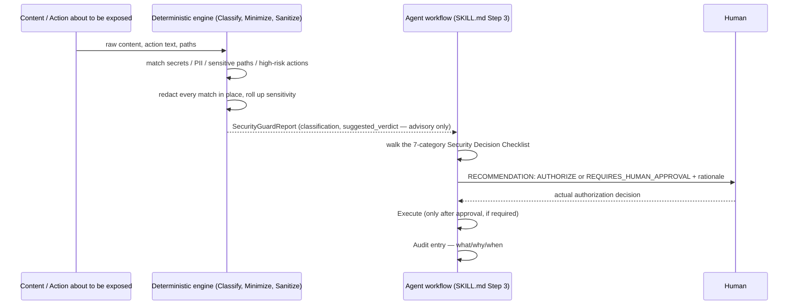

# Building an AI Agent That Can't Authorize Its Own Actions

*Part 5 of 5 in the Agentic Engineering Skills Platform series. Code and
data referenced here are real and current as of Phase 5.
[Repo README](../README.md) · [Part 4](04-your-ai-eval-says-100-percent.md).*

## The rule that has to be a hard rule, not a convention

Every skill in this platform is careful about scope. But
`security-context-guard` is the one skill whose entire *job* is deciding
whether something risky should proceed — which means it's also the one
skill where a subtle implementation slip has a categorically different
kind of consequence than everywhere else in the project. A bug in
`codebase-intelligence` produces a wrong dependency graph. A bug in a
security classifier that quietly starts auto-approving things is the kind
of bug that erodes exactly the trust the skill exists to build.

So this skill's core architectural decision isn't really about what it
does — it's about what it's built to be structurally incapable of doing.

## The workflow: Classify → Minimize → Sanitize → Authorize → Execute → Audit

This six-stage flow comes from
[`project-memory-bank/06-security-model.md`](../project-memory-bank/06-security-model.md),
and until this skill existed, every other skill in the platform followed it
only as an informal principle — redact secrets here, avoid reading `.env`
files there, no single skill implemented the whole workflow as a literal,
runnable thing.



Four stages (Classify, Minimize, Sanitize, Audit-evidence-gathering) are the
deterministic engine's job — mechanical, testable, no ambiguity. Two stages
(Authorize, Execute) are explicitly **not** the engine's job at all, and
that boundary is the whole point of the design.

## What the engine actually does: redact everything, verdict nothing

The engine matches four categories of signal against fixed pattern tables —
secrets (generic credential assignment, private key headers, AWS access key
shapes, bearer tokens), PII (email, phone, SSN-shaped, credit-card-shaped),
sensitive paths (`.env`, `*.pem`, `id_rsa*`, `credentials.json`,
`.aws/credentials`), and six high-risk action categories named verbatim in
the security model (Production modifications, Destructive operations,
Credentials, Security controls, Database migrations, Publishing, External
communications). Every match gets redacted before it reaches any output
surface — extending the redact-not-exclude discipline
[ADR-008](../project-memory-bank/11-decisions.md) first established for
diff content to this whole platform's general classify/sanitize surface.

Then everything rolls up into one classification:

```python
def classify(
    secrets, pii, sensitive_path_matches, action_flags, action_text, content_text,
) -> Classification:
    if secrets:
        sensitivity = "high"
    elif pii or sensitive_path_matches:
        sensitivity = "medium"
    elif content_text.strip():
        sensitivity = "low"
    else:
        sensitivity = "none"

    uncertain = not action_text.strip()

    requires_approval = (
        bool(secrets) or sensitivity in ("medium", "high")
        or bool(action_flags) or uncertain
    )
    suggested_verdict = "REQUIRES_HUMAN_APPROVAL" if requires_approval else "AUTHORIZE"

    return Classification(sensitivity=sensitivity, suggested_verdict=suggested_verdict, ...)
```

Two things about this function matter more than the branching logic itself.

**It fails closed.** `uncertain = not action_text.strip()` — if the caller
doesn't even describe what action is being taken, that alone forces
`requires_approval = True`. The classifier never interprets missing
information as permission to proceed; ambiguity always resolves toward
asking a human, never toward silently authorizing. This is the security
model's honesty-valve category from the [Security Decision
Checklist](../project-memory-bank/05-evaluation-framework.md) implemented
directly in code, not just stated as a principle in a document somewhere.

**Its return value is named `suggested_verdict`, and that's not
decoration.** The word "suggested" is load-bearing. Nothing anywhere in
this codebase treats that field as an executed gate — it's a value on a
dataclass that gets read and reasoned about, never a boolean an `if`
statement branches on to decide whether to actually do something. That's
[ADR-011](../project-memory-bank/11-decisions.md), stated as a hard
architectural rule rather than left as an implicit convention:

> "The deterministic engine never authorizes anything itself; only the
> agent's Step 3 workflow, and ultimately a human, makes the real
> authorization decision."

`SKILL.md`'s Security Constraints section says it even more bluntly: this
skill "cannot self-authorize a production deploy any more than any other
tool can." The recommendation is advice presented to a human, full stop —
never a permission check the code itself passes or fails.

## Even a security skill needs its own security testing — proven the hard way

It would be a little too neat if this post ended there. It doesn't, because
this skill's own dogfood run found a real bug in itself — the first time in
five phases that happened, rather than a dogfood run finding a bug in a
*different* skill.

The action classifier's first version matched "push" and "origin" within a
fixed character-distance window. Run against a real, in-session pending
decision — "Commit and push the new Security Context Guard skill files
(skills/security-context-guard/, evaluations/security-context-guard/,
project-memory-bank updates) to the shared origin repository" — the
parenthetical file list put more than 150 characters between the verb and
its target. The window missed it. The CLI returned `suggested_verdict=AUTHORIZE`
with zero action-category matches, on the exact category of decision
(`Publishing`) this skill exists to flag.

That's worth sitting with for a second: a skill whose entire purpose is
catching things that should require human approval, on its very first real
run, missed the thing it should have caught — not because the
Classify→Minimize→Sanitize→Authorize architecture was wrong, but because
one regex's proximity assumption didn't survive contact with a real
sentence. The fix — same-sentence co-occurrence matching instead of a fixed
window, detailed in [part 3 of this series](03-i-dogfooded-every-skill-i-built.md)
— closed the gap same-session, with a regression test built from the exact
sentence that exposed it. The lesson generalizes past this one skill: a
"leads, not verdicts" architecture is only as good as the leads it
actually generates, and the only way to know whether it's generating the
right ones is to point it at something real and see what it misses.

## Testing the trust question directly, and reporting an honest non-answer

The security model's whole premise is that classifying and sanitizing
content *should* increase an engineer's willingness to grant an agent more
autonomy — that's tracked in this project's assumptions ledger as A7. The
same real dogfood run above doubled as **Pilot C**, an explicitly-labeled
internal pilot (not the real experiment — see
[part 4](04-your-ai-eval-says-100-percent.md) for why that distinction is
enforced everywhere in this project) toward that assumption.

The result, reported exactly as it happened: the structured
`REQUIRES_HUMAN_APPROVAL` recommendation matched what this session already
does regardless of the skill — pushing to a shared repo always gets
confirmed first, for reasons that have nothing to do with
`security-context-guard`. So on this one case, the skill didn't change the
bottom-line decision a human would see. What it *did* add was a concrete,
auditable evidence trail (exact match counts, a named category) that an
unstructured judgment call wouldn't have produced on its own — and it
caught L16 before that false negative could ever reach a real decision.
That's a real, useful finding. It is not evidence that security handling
increases trust, and the assumption stays marked `UNKNOWN`, because the one
case tested didn't have room to show a changed decision either way. Rounding
that up to "the pilot validates A7" would have been easy and would have
been wrong — so it isn't reported that way.

## Why "advisory only, fail closed" is the shape worth keeping

The instinct with AI agents and security is often to add more autonomy
carefully — a confidence score, a graduated auto-approval threshold, "only
ask a human below 80% certainty." This skill deliberately doesn't do that.
One rule (classify and recommend, never authorize; fail closed on
uncertainty, never fail open) is easier to verify, easier to test, and much
harder to accidentally erode one plausible-sounding exception at a time
than a graduated scale would be. If a future skill in this platform also
produces a recommendation-shaped output, the architectural note in
[ADR-011](../project-memory-bank/11-decisions.md) is explicit that it
should inherit this same rule rather than reinvent a softer version of it.

---

That's the series. Five skills, two architectural patterns, five real bugs
found by using each one for real, a self-graded evaluation gap disclosed
rather than hidden, and one hard rule that keeps the skill built to make
safety recommendations from ever being the thing that makes the safety
decision. The [full repository](../README.md) — code, tests, evaluation
harnesses, and the complete project memory bank this series draws from — is
public. If you build on any of it, or find a gap these posts didn't catch,
[open an issue](../CONTRIBUTING.md#reporting-issues) — that's exactly the
kind of evidence this project is built to take seriously.
