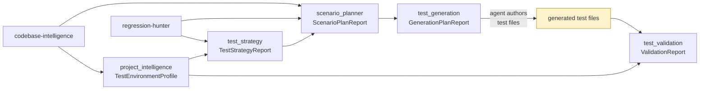

# Why I Built a Second Pipeline Instead of a Sixteenth Skill

*Part 7 in the Agentic Engineering Skills Platform series. All numbers cited
here are real, traceable to specific files in this repository at the time
of writing. [Repo README](../README.md) ·
[Part 6](06-ten-skills-and-the-bug-i-disclosed-four-times-before-fixing.md).*

## Fifteen skills, and a question none of them answer

By the end of Phase 15, this project had fifteen AI-agent skills, 733
passing tests, fifteen evaluation harnesses, and fifteen real dogfood runs.
Three of those skills — `regression-hunter`, `refactoring-safety`,
`release-readiness` — already do something that sounds a lot like "testing
advice": they flag which files are risky, and whether a file already has a
test.

But "has a test" in every one of those skills means exactly one thing: *a
file that looks like a test imports this module.* That's a static-import
heuristic, not evidence that a test runs, passes, or actually exercises the
change. None of the fifteen skills generates a test. None executes one.
None measures whether a change actually broke anything. The roadmap was
closed at Phase 15 — [`08-roadmap.md`](../project-memory-bank/08-roadmap.md)
says so explicitly, "there is no Phase 16" — so the honest question wasn't
"what's skill sixteen," it was "is a sixteenth *skill* even the right
shape for this gap."

## The job that doesn't fit the skill shape

The job-to-be-done, once it's written down plainly, is a pipeline, not a
single judgment call:

> Given a staged diff, determine which changed behaviors need a regression
> test, generate one that matches the target project's real conventions,
> and **prove — not assert — that it compiles/runs and exercises the
> change.**

That's four distinct decisions chained together (what needs a test → what
scenario → what code → does it actually pass), and the last one is
qualitatively different from anything the 15-skill portfolio does: it
requires *running code*, not just analyzing it. Bolting that onto an
existing skill's `SKILL.md` would have quietly changed what "skill" means
in this project — from "a bounded, static-analysis judgment call" to "a
multi-stage execution pipeline." Better to name that shift explicitly than
let it happen by accretion.

## Six packages, not one

So this became a separate track — the **Test Engineering Platform (TEP)**
— logged as its own decision
([ADR-023](../project-memory-bank/11-decisions.md)) and built phase by
phase, the same disambiguation discipline used for every phase of the
original portfolio: each phase started only after an explicit instruction
named it, never "because it was next."

Six new packages, one per stage: `project_intelligence` derives a
`TestEnvironmentProfile` (language, build system, test/mock/coverage
frameworks) from a `codebase-intelligence` report; `test_strategy` decides
which changed files need a test by reusing `regression-hunter`'s existing
risk signal, computing nothing new; `scenario_planner` turns flagged
targets into candidate scenarios; `test_generation` produces a
deterministic plan (never the test code itself — more on that in
[Part 8](08-six-packages-one-pattern.md)); and `test_validation` actually
runs whatever an agent wrote from that plan, via `subprocess.run`, and
records real pass/fail evidence. A seventh package, `evidence`, sits beside
the chain rather than in it — it wraps any single skill's CLI invocation to
record provenance (which skill, which version, which commit, did it
succeed), useful on its own but not something the other five wait on.

## What's genuinely new here, and what isn't

The architecture underneath all six packages is not new — it's the same
deterministic-engine-plus-agent-judgment split
([ADR-005](../project-memory-bank/11-decisions.md)/
[ADR-007](../project-memory-bank/11-decisions.md)) that every one of the 15
skills already uses. `test_generation`'s engine reads real source and
produces a plan; an agent, not the engine, decides what to actually write
in the test file. That continuity is deliberate — this pivot's own product
contract says as much: "this pivot does not introduce a new architectural
philosophy; it applies the existing one to a new output type."

What *is* new, for the first time in this project's history, is
`test_validation`. Fourteen skills produce reports. `workflow-composer`
subprocess-invokes other skills' CLIs, but only ones that themselves
produce reports. `test_validation` is the first package in this repo that
runs code and treats its exit status as the actual product — a real
execution capability, with a real, disclosed risk profile that's genuinely
different from "reads files, writes a report." That distinction is worth
its own post: [Part 9](09-giving-an-agent-execution-capability-then-locking-it-down.md)
covers exactly what got disclosed, and then hardened, about it.

## What this pass didn't do

TEP Phase 5d closed with 166 tests passing (3 skipped, a Windows
symlink-permission limitation, not a failure) across the six packages, on
top of the original 733. What it deliberately didn't do: Human Review,
Engineering Memory extension against TEP's own output, Evaluation/Ablation,
external validation against a real third-party repo, DX/orchestration
tooling, or public distribution — all six remain named, unscoped, and
require their own explicit instruction before any of them start, the same
hard-stop rule that governed every phase before this one. A pipeline that
can generate and run a test is not the same claim as a pipeline that's been
shown to generate a *good* test — that gap is exactly what
[Part 11](11-36-known-limitations-and-counting.md) is about.
