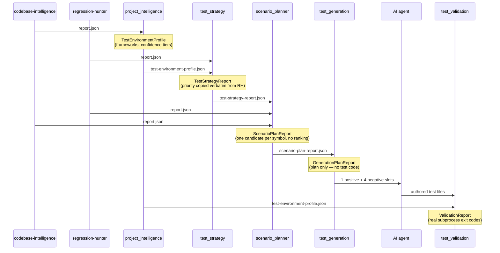

# Six Packages, One Pattern

*Part 8 in the Agentic Engineering Skills Platform series. All numbers cited
here are real, traceable to specific files in this repository at the time
of writing. [Repo README](../README.md) ·
[Part 7](07-why-i-built-a-second-pipeline-instead-of-a-sixteenth-skill.md).*

## The same split, applied six more times

Every one of the original fifteen skills is built from one of two
architectural patterns, and Pattern 2 — a deterministic engine does the
mechanical part, an agent does the judgment part, and the two are never
blurred together — accounts for fourteen of them. The Test Engineering
Platform's six new packages don't introduce a third pattern. They reuse
Pattern 2 six more times, chained: each package's engine is a small,
tested, stdlib-only Python module that consumes the previous stage's typed
JSON report and produces its own; nowhere in the chain does an engine
invent a judgment it isn't equipped to make.

That constraint shows up as a specific, repeated design move: **when a
stage's engine can't determine something safely, it says so in the schema
and passes the decision downstream** — to the next engine, or to the agent.
Four real examples, one per stage:

## 1. `TestEnvironmentProfile` — confidence tiers instead of a guess

`project_intelligence` derives which test/mock/coverage frameworks a repo
uses from `codebase-intelligence`'s existing `external_dependencies` and
`files` output — never by re-parsing manifests a second time. But a
manifest file being *present* (`pyproject.toml` exists) doesn't prove any
dependency was actually extracted from it — `external_deps.py` has known
gaps (L2, L34). So every `Finding` carries a `confidence`:
`dependency-confirmed` (a real dependency entry named this tool) or
`manifest-only` (the manifest exists, but nothing was parsed from it — the
profile can't tell whether that's because the repo genuinely declares
nothing, or because the parser missed it, and says so in `warnings` rather
than picking one). The schema encodes the uncertainty instead of resolving
it with a guess.

## 2. `TestStrategyReport` — priority is copied, not recomputed

`test_strategy` decides which changed files need a test. It would be easy
to have it compute a new, better risk score from `regression-hunter`'s raw
signals. It doesn't — the contract's own mandate is "extend, not replace...
do not build a second, competing risk scorer." So `TestTarget.priority` is
copied **verbatim** from regression-hunter's `overall_risk_tier`, and a
file's absence of test coverage is surfaced even at low risk tier, rather
than filtered out because low-risk files feel less interesting. The
one thing this stage doesn't inherit for free: `regression-hunter`'s own
coverage signal has a known false-positive mode (identically-named modules
across unrelated skills, [L24](../project-memory-bank/12-known-limitations.md)),
and trusting that signal as-is means `test_strategy` inherits it too — logged
as [L36](../project-memory-bank/12-known-limitations.md), not silently
absorbed.

## 3. `ScenarioPlanReport` — every candidate, not the "most likely" one

`scenario_planner` has a real reason to guess: codebase-intelligence's
`ModuleInfo` carries no line-range data, so there's no way to know which
specific function a diff's changed lines actually touched. The tempting
move is to pick the "most likely" function and move on. Instead, when a
file has a structural listing, *every* function and class in it becomes its
own candidate scenario — each one's `rationale` field states outright that
no line-range attribution exists. Guessing at a single answer would have
looked more confident and been less honest; the schema is built to make the
honest version the only option.

## 4. `GenerationPlanReport` — the plan is the entire output

This is the sharpest example. `test_generation` produces a plan naming
exactly which slots need a test (`positive_slot` — one happy path;
`negative_slots` — four, the fixed mid-point of the user's requested 3–5
band) and a `source_excerpt` for each. It does not write a `.py` file.
Why: `codebase-intelligence`'s structural output has no parameter, type, or
exception data — confirmed by direct inspection before this package was
built — so there is no *safe deterministic path* to a plausible negative
test case. Deciding what a plausible negative case even looks like requires
reading real source and reasoning about it. That's the agent's job, not the
engine's, by the same split every other skill in this project already uses.
The engine's entire contribution is getting the agent a good starting
point — a real excerpt, not a blank page — never the content itself.

## Where this stops being about schemas

Once `test_generation`'s plan exists and an agent has authored real files
from it, the chain does something none of the other five stages do:
`test_validation` **runs** those files. That's a different kind of
decision-avoidance problem — not "what judgment should this schema defer,"
but "what does it mean to give an engine permission to execute code it
didn't write, from a plan it built, against a repo it doesn't own." That's
[Part 9](09-giving-an-agent-execution-capability-then-locking-it-down.md).
