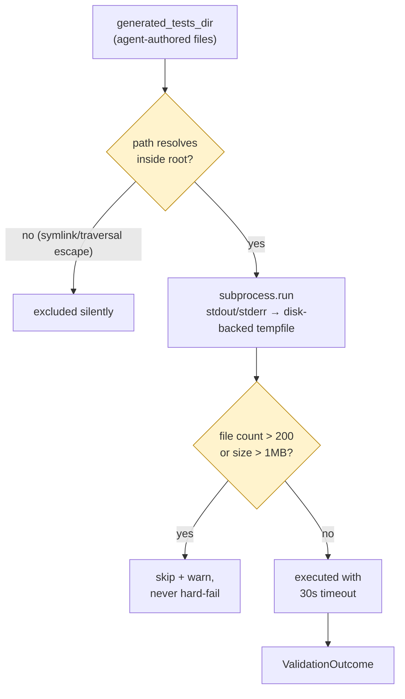

# Giving an Agent Execution Capability, Then Locking It Down

*Part 9 in the Agentic Engineering Skills Platform series. All numbers cited
here are real, traceable to specific files in this repository at the time
of writing. [Repo README](../README.md) ·
[Part 8](08-six-packages-one-pattern.md).*

## Every skill before this one only reads

Fifteen skills. Six earlier TEP packages. Every single one of them is pure
static analysis: parse files, compute a report, write it out. Nothing in
this repository executes a mutating action against a real system — that's
been true since Phase 1, and `security-context-guard` makes it a hard
architectural rule rather than a convention: its engine's recommendation is
always advisory, never self-authorizing.

`test_validation` breaks that pattern, on purpose. Its entire job is to run
code an agent wrote, from a plan `test_generation` built, against a real
target repo — and report whether it actually passed. That's the platform's
first execution capability, and it needed to be named as a risk-class
change the moment it shipped, not folded quietly into "just another
static-analysis package."

## What got disclosed on day one

[ADR-029](../project-memory-bank/11-decisions.md), the decision that
created `test_validation`, says this outright in its Security field:

> A strict per-file timeout is enforced, but there is **no filesystem or
> network sandboxing** beyond what the OS-level test runner itself
> provides — executing a generated test here carries exactly the same risk
> as running that file inside the target repo's own CI.

That's a real, specific boundary, not a hand-wave. `validation_runner.py`
subprocess-invokes `sys.executable -m pytest` with a `PYTHONPATH` pointing
at the target repo (so the repo is *imported*, never *written to*) and a
30-second timeout. No container, no restricted filesystem view, no network
policy. If a generated test can do something harmful to the machine it runs
on, so can any test in that repo's own CI — this package adds no new
capability beyond that, but it doesn't remove any existing risk either, and
the ADR says so instead of implying otherwise.

## Then: what actually needed tightening

Disclosing a boundary honestly is not the same as having checked every
edge of it. A follow-up hardening pass — scoped explicitly to "security /
production hardening," confirmed via a direct question about whether it
should include concrete guards around this exact execution path — ran an
Explore-agent audit first, file:line level, before writing any code. Two
findings mattered most:

**Path containment.** `generated_tests_loader.py`'s file listing filtered
hidden files and `__pycache__` directories, but never resolved anything —
a symlinked file, or a file reached through a symlinked ancestor directory,
inside `generated_tests_dir` would be listed and executed with no check at
all. The fix is the same one-line idea applied to a sibling gap in
`evidence/skill_info.py` (a `..` or absolute `skill_name` silently escaped
`skills_root` under plain path-joining): resolve the candidate path, then
reject anything that isn't `is_relative_to` the intended root.

**Unbounded memory, not unbounded time.** The 30-second timeout was already
real, but `capture_output=True` buffers the entire subprocess's stdout/
stderr *in memory* for the full duration before slicing it down to a 2000-
character excerpt afterward. A test that prints gigabytes before timing out
could exhaust the parent process's memory well before the clock runs out.
The fix redirects to `tempfile.TemporaryFile()` — disk-backed, not
in-memory — and reads back only the tail bytes needed for the excerpt.

I looked at two more "correct" options first and rejected both, on purpose.
`subprocess.Popen` plus `selectors` for a real streaming read is the
textbook-correct answer, but it's real complexity (threads, partial-read
bookkeeping) for a parent-memory-exhaustion fix that isn't a sandboxing
requirement — disproportionate to the actual problem.
`tempfile.SpooledTemporaryFile` looked like a free upgrade until I actually
checked it: it raises `io.UnsupportedOperation` on `.fileno()` while still
under its in-memory threshold — which is exactly the common case, a small,
passing test — so it would have broken the normal path to fix the rare one.
Plain `tempfile.TemporaryFile()` has neither problem.

## What stayed a disclosed gap, not a fixed one

The hardening pass added file-count and file-size caps (200 files / 1MB
default, skip-and-warn rather than hard-fail) and typed-error rejection for
five JSON loaders that previously degraded to a raw `TypeError` on a
wrong-type container. It did **not** add `resource`-module rlimits (POSIX-
only — this platform also runs on Windows), and it did not sandbox
disk usage within the existing timeout window — a test that writes a lot to
disk before 30 seconds elapse still can. [ADR-030](../project-memory-bank/11-decisions.md)
names both explicitly as residual, unaddressed risk, the same discipline
every disclosed limitation in this project follows: say what's still true,
don't imply the fix was more complete than it was.

## The actual lesson

The order mattered more than the content. Shipping the disclosure
(ADR-029) *before* the hardening pass (ADR-030) meant the risk was legible
the entire time it existed — anyone reading this repo between those two
ADRs knew exactly what wasn't protected yet, instead of discovering it
later as a surprise. Hardening a capability you've already told people is
unhardened is a much smaller trust event than hardening one you'd implied
was safe all along.
