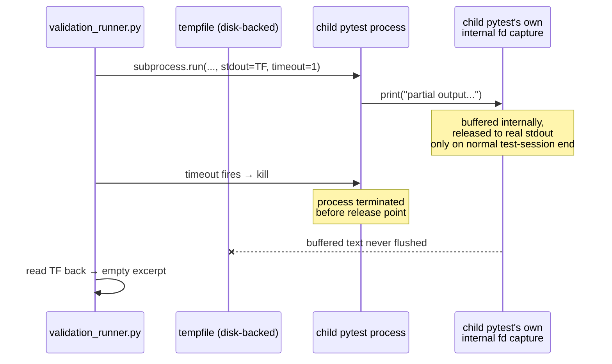

# The Test That Lied to Me

*Part 10 in the Agentic Engineering Skills Platform series. All numbers
cited here are real, traceable to specific files in this repository at the
time of writing. [Repo README](../README.md) ·
[Part 9](09-giving-an-agent-execution-capability-then-locking-it-down.md).*

## A test that looks obviously correct

While hardening `test_validation`'s subprocess-execution path (see
[Part 9](09-giving-an-agent-execution-capability-then-locking-it-down.md)),
I needed a regression test proving the timeout path still behaved
correctly after switching from in-memory `capture_output=True` to a
disk-backed `tempfile.TemporaryFile()`. The obvious test: write a fixture
that prints something, then hangs forever; run it with a short timeout;
assert the process gets killed *and* that the text it printed before the
kill still shows up in `stdout_excerpt`. Something like:

```python
def test_timeout_still_captures_partial_output(tmp_path):
    test_file = tmp_path / "test_slow.py"
    test_file.write_text(
        "import time\n"
        "def test_it():\n"
        "    print('partial output before timeout')\n"
        "    time.sleep(10)\n"
    )
    outcome = run_validation(test_file, tmp_path, "pytest", timeout_seconds=1)
    assert outcome.timed_out is True
    assert "partial output before timeout" in outcome.stdout_excerpt
```

This looks correct. It reads correct. Both assertions are about real,
observable behavior of the code I'd just changed. I almost let it stand as
written.

## Running it instead of trusting it

I ran it anyway, because this project's own discipline is "verify before
claiming done," not "verify when it looks suspicious." It failed:

```
AssertionError: assert 'partial output before timeout' in ''
```

Not a flaky failure, not a timing fluke — `stdout_excerpt` was the empty
string, every time. The assertion I was most confident about was wrong,
and the honest next step wasn't to tweak the test until it passed; it was
to find out why the print never showed up at all.

## Why the print never arrives



`run_validation` invokes `sys.executable -m pytest <test_file>` as the
child process. That child is *itself* a pytest session, and pytest's own
default output capturing intercepts writes to file descriptor 1 for the
test it's running, buffering them internally rather than letting them fall
straight through to the real stdout my code was reading from. That buffer
only gets released to the real stdout at specific points in a normal test
session — typically when reporting a failure. A hard kill from
`subprocess.run`'s `timeout=` parameter terminates the child before it ever
reaches that release point. The print genuinely executed. It just never
escaped pytest's own capture before the process died.

The detail that mattered most for deciding what to do about it: **this was
already true of the code before my change.** The old
`capture_output=True` implementation read from `exc.stdout` on a
`TimeoutExpired`, but `exc.stdout` is populated from the exact same pipe —
same child process, same internal pytest capture, same missing release
point. My tempfile-based rewrite didn't introduce this behavior. It just
happened to be the first time anyone wrote a test that actually checked it.

## Fixing the claim, not the code

There was nothing to fix in `validation_runner.py` — the timeout handling
was already correct; it just couldn't deliver a guarantee I'd assumed it
could. So the fix was to the test's claim, not the implementation:

```python
def test_timeout_does_not_crash_when_child_wrote_output_before_being_killed(tmp_path):
    ...
    outcome = run_validation(test_file, tmp_path, "pytest", timeout_seconds=1)
    assert outcome.timed_out is True
    assert outcome.exit_code is None
    assert isinstance(outcome.stdout_excerpt, str)
    assert isinstance(outcome.stderr_excerpt, str)
```

Renamed to describe what's actually true (robustness under a kill, not
content preservation), and reduced to assertions that hold regardless of
pytest's own internal capture behavior. I re-ran the full
`test_validation_runner.py` file afterward — all 8 tests passing, no other
assumption in that file had the same problem.

## Why this is the interesting part

The bug wasn't in the code. It was in a test I would have shipped without
running, because it *read* as obviously true — printed text, short delay,
straightforward assertion. Nothing about the code review would have caught
it; the only thing that caught it was actually executing the test against
real process behavior instead of trusting that the English sentence
describing it was accurate. Every disclosed limitation elsewhere in this
project ([Part 11](11-36-known-limitations-and-counting.md) covers the
whole list) came from the same habit applied to production code. This is
what it looks like applied to a test, before it ever reached anyone else.
