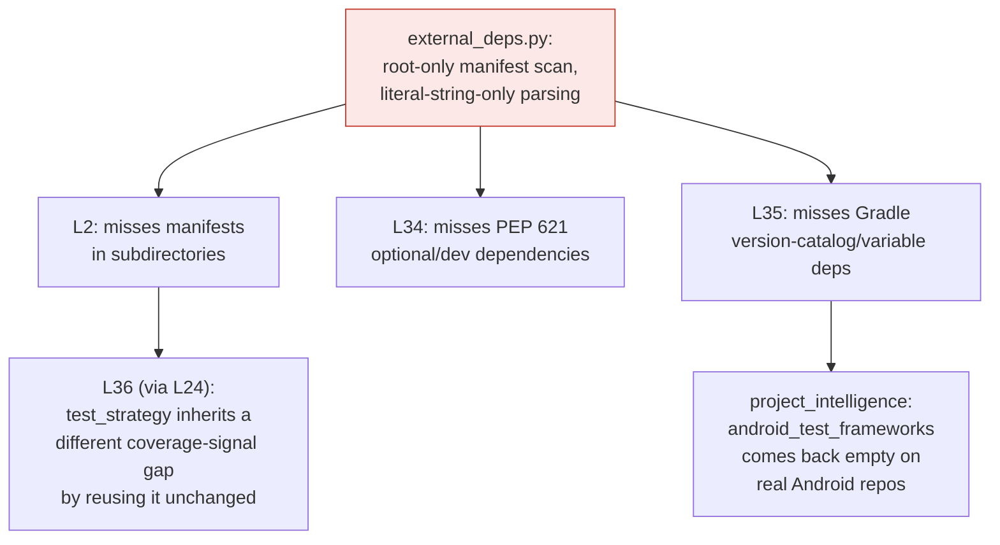

# 36 Known Limitations and Counting

*Part 11 in the Agentic Engineering Skills Platform series. All numbers
cited here are real, traceable to specific files in this repository at the
time of writing. [Repo README](../README.md) ·
[Part 10](10-the-test-that-lied-to-me.md).*

## A log, not a hall of shame

[`project-memory-bank/12-known-limitations.md`](../project-memory-bank/12-known-limitations.md)
held 36 numbered entries — L1 through L36 — for the entire life of the
Test Engineering Platform pipeline described in this series, growing by
roughly one per phase since Phase 1. Writing this very post is what
produced the 37th: pulling the whole known-limitations file together to
write about it surfaced a real, previously-undisclosed gap (no CI job
covers four of the six TEP packages — now logged as L37), which is itself
the point this post is making. Most of the 36 disclose something small and
specific:
`has_main_guard` false-positives on a string mention that merely *contains*
`if __name__`. Some disclose something structural: `dependency-supply-chain`
will never do live CVE lookups, a permanent scope decision, not a bug
waiting to be fixed. A few disclose something that actually mattered later.
The point of the file isn't confession — it's that every entry follows the
same five-line shape (What failed, Why, Impact, Fix, Regression prevention)
whether the news is small or not, so a future reader can tell the
difference between "cosmetic and scoped out on purpose" and "open, real,
and worth checking before you rely on this," without having to ask.

## The pattern that should have been caught sooner

[Part 6](06-ten-skills-and-the-bug-i-disclosed-four-times-before-fixing.md)
told the story of a substring-matching bug — `"scanner"` matching inside
`"testability_scanner"` — that got disclosed four separate times (L14, L19/
L21, L23, L24) across three different phases before it was actually fixed.
The Test Engineering Platform's own known-limitations entries turned up a
second instance of the same shape, this time in dependency parsing rather
than caller resolution:

L2 (root-only manifest scanning, Phase 1), L34 (PEP 621 optional/dev deps
invisible, TEP Phase 3), and L35 (Gradle version-catalog interpolation
unresolved, TEP Phase 4) all trace back to the same root cause in
`external_deps.py`, found and disclosed in three different phases, in three
different files, without ever being connected into one entry until this
documentation pass. None of them is *wrong* individually — each is a
correctly-scoped, honestly-described limitation of its own consumer. What
was missing was the connective tissue: a reader hitting L35 while
investigating an empty `android_test_frameworks` result had no pointer
telling them this was the third surfacing of the same underlying gap, not
a new, unrelated one.

## Why the chain matters more than any single link

A single disclosed limitation answers "does this feature have a known
edge case." A *connected* chain answers a more useful question: "if I fix
the root cause, how many downstream symptoms does that one fix actually
resolve?" Before this pass, answering that required manually cross-
referencing three phases' worth of memory-bank entries. Now it's one
paragraph. That's a small thing to add, and it's exactly the kind of small
thing that compounds — the same way L23's fix (a word-boundary-aware regex,
`\bscanner\b` instead of `"scanner" in text`) closed one collision class
across three skills at once, because someone finally looked at the pattern
instead of the individual instance.

## The number that actually matters isn't 37

37 disclosed limitations is not a scoreboard to minimize — a project that
had zero disclosed limitations after 21 packages and 899 passing tests
would be evidence of under-looking, not over-performing. The number that
matters is how many of those 37 are the *same* limitation rediscovered
because nobody connected it the first time. Before this pass: at least two
known chains (the substring-matching family from Part 6, and the
`external_deps.py` family above). The fix in both cases wasn't clever
engineering — it was writing the connection down the second time it showed
up, instead of waiting for the fourth.

That's the actual discipline this series keeps returning to, across
fifteen skills and six TEP packages: not "never have a limitation," but
"never let the same one surprise you twice." Every ADR in this project
states the tradeoff it's making in the same breath it makes it. Every
known limitation states what would need to be true before it's worth
fixing. Neither habit prevents a bug from existing. Both make it much
harder for one to go unnoticed a second time.
